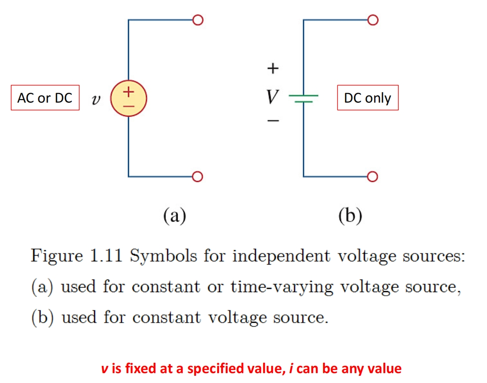
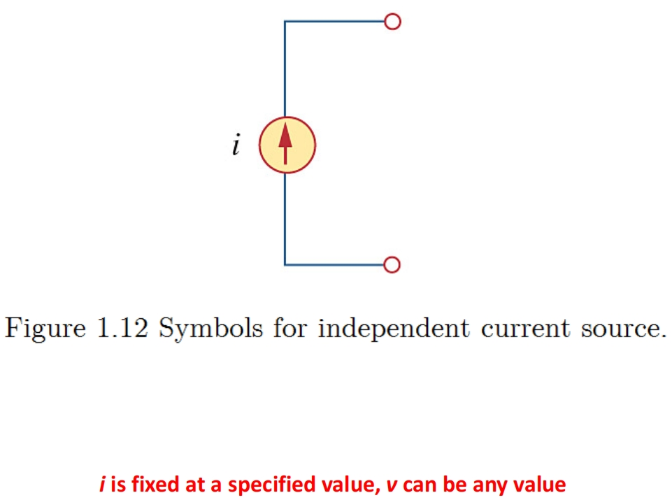
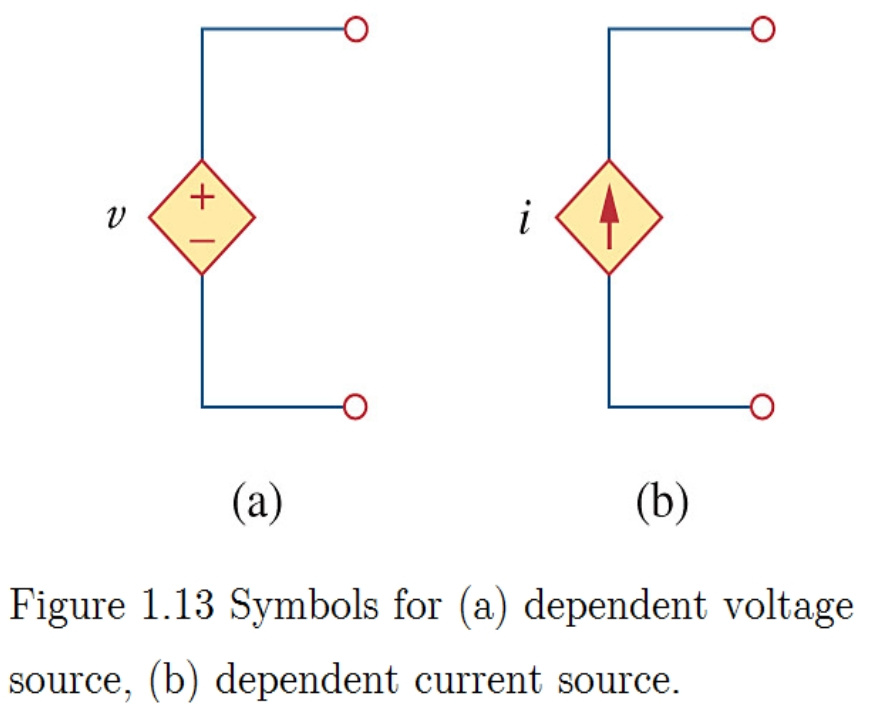
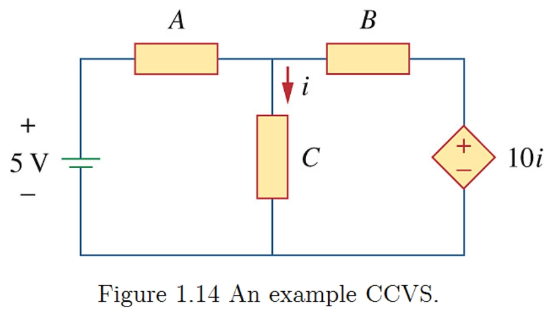

# Intro. to Circuits

 Concept | English | Short | Unit / Note
 :-: | :-: | :-: | :-:
 电路 | electric circuit
 元件 | element  
 电极 | (positive/negative)   terminal | $+/-$ |
 电子 | electron | e
 质子 | proton | p
 中子 | neutron|  n 
 | | |
 用电 元件 | passive elements   (被灌电) | $p>0$   $+vi$ | PSC, 状态
供电 元件 | active elements   (给电) | $p<0$   $-vi$ | PSC, 状态
无源 元件 | passive element model physical devices | cannot gen elec energy | eg. 阻容感
有源 元件 | active element model devices | can gen elec energy | eg. operational amplifiers
| | |
 电荷 | Charge | Q |Coulumbs 库仑 
 电流 | Current | i | Ampere 安培 
直流电 | direct current  | DC | A
交流电 | alternating current | AC | A
瞬时功率 | instantaneous   power | p | Watts 瓦
能量 | Energy | E | Joules 焦耳
电阻 | resistor | R | $\Omega$ Ohms
电容 | capacitor |
电感 | inductor
运算放大器 | operational amplifier |
变压器| transformer|
三极管 (晶体管) | transistor

## Chapter 1: Basic Concepts

### Charge and Currents
Charge:
-  an electrical property 
of the atomic particles of which matter consists
- Coulomb = Ampere $\times$ Second
- $1$ electron = $1.602\times 10^{-19}$ C
- $1$ C = $6.24\times 10 ^{18} $ electrons
- Law of conservation of charge 电荷守恒定律

电荷和电流的关系：
- $i=\frac{dq}{dt}$
- $Q=\int_{t_0}^{t}dt$

direct current 直流电
- the unidirectional flow of 
electric charge 单向电流
- remains constant with time 常电流 (textbook)

alternating current 交流电
-  the movement of electric charge periodically reverses direction 周期变向电流
- a current that varies sinusoidally with time 正弦电流 (textbook)

例题：

$i=\begin{cases}
2\text{A}, 0<t<1\text{s}\\
2t^2\text{A}, t>1\text{s}
\end{cases}$

求 0-2s charge entering the element.

Solution:

$Q=\int_0^2i\,dt=\int_0^1 i\,dt+\int_1^2 i\,dt=2t\big|_0^1+2\frac{t^3}{3}\Big|_1^2=2+\frac{14}{3}\approx 6.667$ (C)

直接利用公式代入求解即可

### Voltage
Voltage 电压，即电势差/电动势 (potential difference):
- the energy (or work) required to move a unit charge through an element, measured in volts (V)
- $V_{ab}=\frac{dw}{dq}$
- "+""-" is to define the reference direction/polarity of the voltage

### Signal
Current and voltage are the two basic 
variables in electric circuits. The common term _signal_ is used for an electric quantity such as a current or a voltage (or even electromagnetic wave) when it is used for _conveying information_. 

*信号* 是电学物理量 (电压/电流/电磁波) 被用于 *传递信息* 时的常规代称

### Power and Energy
Power:
- the time rate of expending or absorbing energy, measured in watts (W).
- the instantaneous power _absorbed_ by an element:
    - $p=\frac{dw}{dt}=\frac{dw}{dq}\frac{dq}{dt}=vi$

电路功率标记方法：
- **Passive sign convention (PSC)** 
    - When the current enters through the positive terminal of an element and $p = +vi$. 
    - 正进负出用电器 (*passive*), $p>0$ for **absorbing** power. 
    - If the current enters through the negative terminal, $p= −vi$. 
    - 负进正出给电器 (*active*), $p<0$ for **supplying** power.

- Active sign convention (ASC): Opposite to PSC.

According to the conservation of energy, $\sum p = 0$.

Energy:
- the capacity to do work, measured in joules (J)
- Energy absorbed: $w = \int_{t_0}^t p\,dt = \int_{t_0}^t vi\,dt$

例题：

Find the power delivered to an element at $t=5$ ms if the current entering its positive terminal is $i=5\cos60\pi t$ A and the voltage is: 
(a) $v=2i$ V.  
(b) $v=\left( 10+5\int_0^t i\,dt \right)$ V.

Solution:

(a) The power delivered to the element is 17.27W: 
$$
p=vi=2i^2=2\times(5\cos 60 \pi t)^2\\
=50\cos^2 60 \pi t = 50\cos^2 (60\pi\times 5\times 10^{-3} ) \\ 
\approx 17.27 \, (\text{W})
$$
(b) The power delivered to the element is 29.70W:
$$
\begin{align*}
v&=\left( 10+5\int_0^t i\,dt \right)=10+5\int_0^t 5\cos 60 \pi t\\
&=10+\frac{5}{12}\sin 60 \pi t\Big|_0^t=10+\frac{5}{12\pi}\sin 60 \pi t\\
&= 10+\frac{5}{12\pi}\sin (60\pi\times0.005)\approx 10.1073 \,(\text{V})\\
i&=5 \cos (60\pi t)=5\cos(60\pi\times0.005)\\
&\approx 2.9389\,(\text{A})\\
p&=vi=10.1073\times 2.9389\approx 29.70\,(\text{W})
\end{align*}
$$

### Circuit Elements 电子元件
Two type:
- Passive elements model physical devices 
    - cannot generate electric energy
    - resistors 电阻, capacitors 电容, inductors 电感, ...
- Active elements model devices
    - capable of generating electric energy
    - generators 发电机, batteries 电池, operational amplifiers 运算放大器, ...

Sources (active elements, 形状决定独立, 符号决定电学量):
- Independent sources 独立源
    - ideal independent voltage source (理想恒压电源, 圆交/直, 线直, $+-$ )

    - ideal independent current source (理想恒流电源, 圆箭头, $\uparrow$ )

- Dependent (or controlled) sources 受控源
    -  the source quantity is 
controlled by another voltage or current. (菱形受控，符号源类，公式显示受控类型及相关量) 
eg. op-amp 运算放大器，transformers 变压器，transistors 晶体管
    - voltage-controlled voltage source (VCVS, 压控电压源)
    - **C** C **V** S (流控电压源)
    - **V** C **C** S (压控电流源)
    - **C** C **C** S (流控电流源)
    - symbol: 
    - example: a CCVS: 菱形表示受控，$+-$表示电压源，10 $i$ 表示其两端电压数值大小(V)为流过中路元件的电流 ($i$) 数值的10倍(A) 

## Chapter 2: Basic Laws

### Ohm's Law 欧姆定律：
